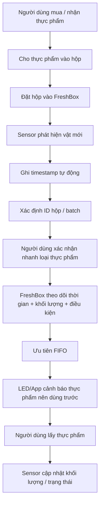

# FreshBox / Smart Fridge Box — Định hướng sản phẩm

## 1. Định hướng sản phẩm

### Product concept

**FreshBox** là một **module lưu trữ thông minh có thể đặt thêm vào tủ lạnh gia đình hiện có** (retrofit smart fridge module), giúp người dùng theo dõi thực phẩm theo **từng batch / từng lần đưa vào tủ** thay vì chỉ theo tên thực phẩm.

Sản phẩm không yêu cầu người dùng mua một chiếc tủ lạnh thông minh mới. Thay vào đó, FreshBox được đặt trực tiếp lên một ngăn trong tủ lạnh và hoạt động như một **smart storage zone**.

Mỗi thực phẩm hoặc hộp đựng khi được đặt vào FreshBox sẽ được ghi nhận:

- Loại thực phẩm
- Batch / lần đưa vào tủ
- Thời điểm đưa vào
- Vị trí trong FreshBox
- Khối lượng ban đầu / khối lượng còn lại
- Lịch sử lấy ra / đặt lại
- Nhiệt độ môi trường lưu trữ
- Mức độ ưu tiên sử dụng

Điểm cốt lõi của sản phẩm là:

> **Không chỉ biết “trong tủ có thịt lợn”, mà phải biết “đang có 2 batch thịt lợn: một batch từ ngày 01/09 và một batch từ ngày 08/09, và batch 01/09 nên được sử dụng trước”.**

---

## 2. Product architecture đề xuất

Thay vì đặt toàn bộ cảm biến, pin và vi điều khiển vào từng hộp thực phẩm, nên chia hệ thống thành hai lớp.

### 2.1. Smart Rack / Smart Storage Zone — phần chủ động

Đây là phần giống thiết kế trong hình minh họa.

Có thể tích hợp:

| Thành phần | Chức năng |
|---|---|
| Load Cell / cảm biến trọng lượng | Xác nhận có thực phẩm, theo dõi thay đổi khối lượng |
| ToF / proximity sensor | Phát hiện vật được đặt vào hoặc lấy ra |
| Temperature sensor | Theo dõi điều kiện bảo quản |
| Humidity sensor | Hỗ trợ theo dõi rau củ / môi trường |
| LED indicator | Báo hộp cần dùng trước |
| Display nhỏ | Hiển thị số lượng, thời gian, cảnh báo |
| BLE / Wi-Fi | Đồng bộ với ứng dụng |
| Camera tùy chọn | Hỗ trợ nhận diện thực phẩm |

### 2.2. Food Container / Food Tag — phần thụ động

Hộp đựng không nhất thiết phải chứa electronics.

Mỗi hộp có thể chỉ cần:

- QR Code
- NFC tag
- RFID tag
- ID cố định theo hộp

Nhờ đó:

- dễ rửa;
- giá thành hộp thấp;
- không cần sạc pin cho từng hộp;
- có thể có nhiều kích thước hộp khác nhau;
- electronics chỉ tập trung trên Smart Rack.

---

## 3. Workflow sản phẩm dự kiến



Mục tiêu UX:

> Người dùng không phải “quản lý kho”, mà chỉ cần **đặt đồ vào đúng khu vực**. Hệ thống tự làm phần tracking còn lại.

---

# 4. Problem Statement

## Problem Statement đề xuất

> **Các hộ gia đình thường lưu trữ thực phẩm trong tủ lạnh từ nhiều nguồn và tại nhiều thời điểm khác nhau, bao gồm thực phẩm mua từ chợ/siêu thị, đồ ăn thừa và thực phẩm người thân gửi lên. Khi số lượng thực phẩm tăng, người dùng khó nhớ chính xác đang có những gì, thực phẩm được đưa vào từ khi nào và batch nào nên được sử dụng trước. Đặc biệt, khi cùng một loại thực phẩm được lưu vào tủ ở nhiều thời điểm khác nhau, các batch dễ bị nhầm lẫn và thực phẩm cũ có thể tiếp tục bị bỏ quên. Điều này dẫn đến mua trùng, lưu trữ quá lâu, hư hỏng thực phẩm và lãng phí tiền bạc.**

### Actor

Hộ gia đình nhỏ và trung bình, đặc biệt:

- Gia đình 2–5 người
- Sinh viên / người trẻ ở trọ
- Gia đình thường mua thực phẩm theo tuần
- Gia đình thường nhận thịt, cá, rau hoặc thực phẩm từ quê gửi lên

### Current workflow

```text
Mua / nhận thực phẩm
        ↓
Chia thực phẩm
        ↓
Cho vào túi / hộp
        ↓
Đặt vào ngăn mát / ngăn đông
        ↓
Dựa vào trí nhớ để biết còn gì
        ↓
Đồ mới tiếp tục được thêm vào
        ↓
Đồ cũ bị che / đẩy sâu vào trong
        ↓
Không nhớ batch nào cũ hơn
        ↓
Quên sử dụng
        ↓
Hư hỏng / phải bỏ đi
```

### Bottleneck chính

**Thông tin về thực phẩm bị mất ngay tại thời điểm thực phẩm được đưa vào tủ lạnh.**

Sau khi người dùng đóng cửa tủ lạnh, hệ thống hiện tại gần như không lưu lại:

- món gì vừa được đưa vào;
- batch nào;
- ngày giờ nào;
- số lượng bao nhiêu;
- món nào đã tồn tại từ trước;
- món nào cần được sử dụng trước.

Người dùng phải duy trì tất cả thông tin này bằng trí nhớ.

---

# 5. Xác định Pain Point

## Pain Point 1 — Không biết chính xác trong tủ đang có gì

Thực phẩm được phân bố giữa ngăn mát, ngăn đông, các hộp kín, túi zip, ngăn kéo rau và các vị trí bị che khuất. Người dùng thường chỉ nhớ một phần inventory.

### Hậu quả

- mua trùng;
- quên thực phẩm;
- không tận dụng được thực phẩm đang có.

## Pain Point 2 — Không nhớ thời điểm đưa thực phẩm vào

Thịt, cá, rau hoặc thức ăn chín thường được cho trực tiếp vào hộp/túi mà không ghi ngày. Sau một thời gian, người dùng không còn biết túi thực phẩm đó để từ hôm nào.

### Hậu quả

- không biết nên sử dụng hay bỏ đi;
- thực phẩm bị lưu quá lâu;
- tăng nguy cơ hư hỏng.

## Pain Point 3 — Cùng một loại thực phẩm nhưng có nhiều batch khác nhau

Ví dụ:

| Batch | Thực phẩm | Ngày đưa vào |
|---|---|---|
| A | Thịt lợn | 01/09 |
| B | Thịt lợn | 05/09 |
| C | Thịt lợn | 09/09 |

Trong nhận thức của người dùng, ba batch này thường bị giản lược thành:

> **“Trong tủ còn thịt lợn.”**

Do đó, người dùng có thể lấy batch mới trước và tiếp tục để batch cũ nằm lại.

### Hậu quả

Không thực hiện được FIFO: **First In → First Out**.

## Pain Point 4 — Đồ mới che đồ cũ

Khi mua hoặc nhận thêm thực phẩm, người dùng thường đặt thực phẩm mới vào vị trí dễ lấy. Thực phẩm cũ bị đẩy sâu, che khuất, chuyển xuống dưới hoặc nằm trong ngăn đông nhiều tuần.

## Pain Point 5 — Đồ quê gửi lên tạo inventory ngoài kế hoạch

Gia đình có thể đã mua đủ thực phẩm cho một tuần nhưng bất ngờ nhận thêm thịt, cá, giò, rau hoặc hoa quả.

```text
Inventory hiện tại
        +
Thực phẩm nhận thêm
        ↓
Tủ lạnh quá nhiều đồ
        ↓
Khó quan sát
        ↓
Khó tracking
        ↓
Đồ bị bỏ quên
```

## Pain Point 6 — Người dùng không biết món nào nên ăn trước

Ngay cả khi nhớ được trong tủ có gì, người dùng vẫn phải tự suy luận món nào cũ hơn, dễ hỏng hơn và nên dùng trong hôm nay.

## Pain Point 7 — App inventory hiện tại yêu cầu nhập liệu quá nhiều

Nếu mỗi lần cho thực phẩm vào tủ người dùng phải mở app, thêm item, chọn loại, nhập quantity, vị trí, ngày, expiry rồi save thì khả năng duy trì lâu dài thấp.

Pain thật không chỉ là:

> “Làm thế nào để track thực phẩm?”

mà là:

> **“Làm thế nào để track đủ chính xác mà người dùng gần như không cần làm thêm việc?”**

---

# 6. Hướng giải quyết

## Solution direction

### FreshBox = Smart Storage Zone + Passive Food Container + Mobile App

Thay vì biến toàn bộ tủ lạnh thành smart fridge, FreshBox tạo ra một **khu vực thông minh bên trong tủ lạnh hiện tại**.

## Chức năng 1 — Automatic timestamp

Khi một hộp mới được đặt vào:

```text
Sensor detect
        ↓
Item added
        ↓
Timestamp = 12/09 - 18:35
```

Người dùng không cần tự nhập ngày.

## Chức năng 2 — Batch tracking

Mỗi hộp có một ID.

```text
Container 01
Food: Pork
Stored: 01/09

Container 04
Food: Pork
Stored: 08/09
```

Hệ thống coi đây là hai object khác nhau dù loại thực phẩm giống nhau.

## Chức năng 3 — FIFO recommendation

FreshBox có thể xếp thứ tự:

```text
USE FIRST

1. Pork — 01/09
2. Fish — 03/09
3. Pork — 08/09
```

LED trên rack có thể đánh dấu vị trí cần dùng trước.

## Chức năng 4 — Weight tracking

Load cell theo dõi:

```text
Initial: 800 g

After use:
800 g → 520 g → 250 g → 0 g
```

Khi trọng lượng về gần 0, hệ thống có thể tự chuyển trạng thái sang **Consumed / Empty**.

## Chức năng 5 — Storage condition monitoring

FreshBox lưu nhiệt độ, độ ẩm, thời gian và lịch sử thay đổi. Dữ liệu này hỗ trợ đưa ra **freshness estimation**, nhưng không nên được sử dụng để khẳng định thực phẩm “an toàn tuyệt đối để ăn”.

## Chức năng 6 — Notification

Ứng dụng chỉ cảnh báo khi cần:

```text
⚠ Thịt lợn batch 01/09 nên được sử dụng trước.

⚠ Hộp cá đã được lưu 3 ngày.

⚠ Có 2 batch thịt lợn trong tủ.
Hãy sử dụng batch cũ trước.
```

---

# 7. Phạm vi MVP

## MVP 1 — Không cần AI phức tạp

| Feature | MVP |
|---|---|
| Detect add/remove | Có |
| Timestamp tự động | Có |
| Container ID | Có |
| Weight sensor | Có |
| Temperature | Có |
| FIFO | Có |
| LED | Có |
| Mobile app | Có |
| Camera AI | Chưa cần |
| Gas sensor | Chưa cần |
| Freshness AI | Chưa cần |

MVP cần chứng minh trước giả thuyết:

> **Nếu quá trình ghi nhận inventory gần như tự động, người dùng có duy trì việc tracking thực phẩm đủ lâu để giảm đồ bị quên hay không?**

---

# 8. Phương pháp đánh giá và đo lường

## 8.1. Giả thuyết cần kiểm chứng

### H1 — FreshBox giảm thực phẩm bị quên

Người dùng có thể nhìn thấy đầy đủ inventory và biết batch nào cần dùng trước.

### H2 — FreshBox giảm thao tác nhập liệu

Việc thêm thực phẩm phải nhanh hơn đáng kể so với app inventory nhập tay.

### H3 — FreshBox giúp phân biệt các batch giống nhau

Hệ thống phải biết **Pork A ≠ Pork B** dù cùng loại thực phẩm.

### H4 — FreshBox giảm food waste

Sau thời gian sử dụng, lượng thực phẩm bị bỏ đi phải giảm.

---

# 9. Metrics

## A. Problem Metrics

### 1. Forgotten Item Rate

```text
Số thực phẩm người dùng quên đang có
-------------------------------------
Tổng số thực phẩm trong tủ
```

Ví dụ: 10 items, người dùng quên 3 items → Forgotten Item Rate = 30%.

### 2. Food Waste Quantity

Đo số món bị bỏ/tuần và gram hoặc kg/tuần.

### 3. Food Waste Cost

Tổng giá trị thực phẩm bị bỏ, đơn vị **VNĐ / tuần / hộ gia đình**.

### 4. Duplicate Purchase Rate

Số lần mua một món mới nhưng về nhà phát hiện món đó vẫn còn, đo theo **lần / tháng**.

### 5. Inventory Checking Time

Đặt câu hỏi “Trong tủ hiện có những gì?” và đo thời gian từ lúc bắt đầu kiểm tra đến khi người dùng trả lời đầy đủ.

---

# 10. Product Metrics

| Metric | Mục tiêu prototype |
|---|---:|
| Add / Remove Detection Accuracy | ≥ 95% |
| Batch Tracking Accuracy | ≥ 90% |
| Weight Measurement Error | ±5–10 g tùy load cell |
| User Input Time | < 5 giây/item |
| Manual Interaction | ≤ 1 confirmation/item |
| False Alert Rate | < 10% |

---

# 11. Thiết kế thí nghiệm

## Phase A — Baseline

Theo dõi 5–10 hộ gia đình trong **7 ngày** mà chưa sử dụng FreshBox.

Ghi:

- inventory đầu tuần;
- đồ bị quên;
- đồ mua trùng;
- đồ bị bỏ;
- giá trị đồ bỏ;
- thời gian kiểm tra tủ.

## Phase B — Prototype

Cho cùng nhóm sử dụng FreshBox trong **14 ngày** và đo lại cùng metrics.

## Phase C — Compare

| Metric | Baseline | FreshBox | Improvement |
|---|---:|---:|---:|
| Forgotten item rate | X | Y | % |
| Food waste / tuần | X | Y | % |
| Food waste cost | X | Y | % |
| Duplicate purchase | X | Y | % |
| Inventory checking time | X | Y | % |
| Manual input / item | X | Y | % |

---

# 12. Success Criteria đề xuất cho prototype

> **Các con số dưới đây là mục tiêu thử nghiệm ban đầu, không phải kết quả đã được kiểm chứng.**

| Metric | Target |
|---|---:|
| Forgotten item rate | giảm ≥ 50% |
| Food waste quantity | giảm ≥ 30% |
| Duplicate purchase | giảm ≥ 30% |
| Batch tracking accuracy | ≥ 90% |
| Add/remove detection | ≥ 95% |
| Registration time | < 5 giây/item |
| User confirmation | ≤ 1 action/item |
| Người dùng muốn tiếp tục dùng | ≥ 70% |

---

# 13. Boundary

FreshBox **không nên tuyên bố** xác định thực phẩm an toàn tuyệt đối, thay thế đánh giá của người dùng, phát hiện tất cả vi khuẩn/pathogen hoặc xác định chính xác hạn sử dụng cho mọi loại thực phẩm.

FreshBox nên tập trung vào:

> **Inventory awareness + batch tracking + storage history + consumption priority.**

Freshness estimation có thể là feature nâng cao sau khi sản phẩm đã chứng minh được giá trị ở bài toán inventory.

---

# 14. Product Positioning

Không nên định vị FreshBox là:

> “Một chiếc tủ lạnh thông minh mini.”

Nên định vị là:

> **“Một lớp thông minh bổ sung cho tủ lạnh hiện tại.”**

Hoặc:

> **FreshBox — hệ thống giúp gia đình biết trong tủ đang có gì, được cất từ khi nào và món nào nên dùng trước.**

USP quan trọng nhất:

> **Low-friction batch tracking for fresh food.**

Đặc biệt giải quyết tốt trường hợp:

```text
Thịt lợn 01/09
       ≠
Thịt lợn 08/09
```

mà camera nhận diện thông thường có thể chỉ nhìn cả hai là `Pork`.

---

# 15. Kết luận

Giá trị lớn nhất của FreshBox không nằm ở việc nhồi càng nhiều sensor càng tốt.

Giá trị cốt lõi là:

> **Biến mỗi lần thực phẩm được đưa vào tủ lạnh thành một digital batch có danh tính, thời gian và trạng thái riêng, nhưng không buộc người dùng phải tự duy trì một “bản sao kỹ thuật số” của tủ lạnh bằng tay.**

Định hướng phù hợp nhất cho giai đoạn đầu:

```text
Smart Rack
    +
Passive Container ID
    +
Automatic Timestamp
    +
Weight Tracking
    +
FIFO
    +
LED / App Reminder
```

Sau khi chứng minh được người dùng thực sự giảm việc quên và bỏ thực phẩm, mới tiếp tục nghiên cứu:

```text
Camera Recognition
Gas / VOC Sensor
Freshness Estimation
AI Recommendation
```

Cách này giúp sản phẩm tránh rơi vào tình trạng **“công nghệ rất hay nhưng người dùng không cần”**, đồng thời giữ chi phí MVP và rủi ro kỹ thuật ở mức kiểm soát được.
